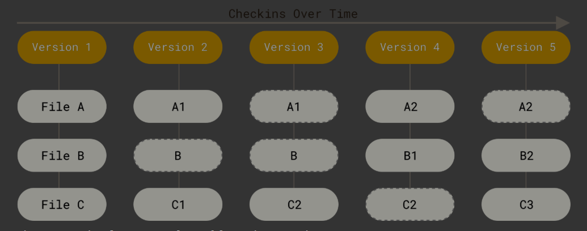

# How does Git work in a nutshell?
* Git thinks of its data more like a series of snapshots of a miniature filesystem. 
* With Git, every time you commit, or save the state of your project, Git basically takes a picture of what all your files look like at that moment and stores a reference to that snapshot.
* To be efficient, if files have not changed, Git doesn’t store the file again, just a link to the previous identical file it has already stored.
* Git thinks about its data more like a stream of snapshots.



# The Three States

Pay attention now — here is the main thing to remember about Git if you want the rest of your learning process to go smoothly. Git has three main states that your files can reside in: modified, staged, and committed:

* Modified means that you have changed the file but have not committed it to your database yet.

* Staged means that you have marked a modified file in its current version to go into your next commit snapshot.

* Committed means that the data is safely stored in your local database.

# The basic Git workflow goes something like this:

1. You modify files in your working tree.

2. You selectively stage just those changes you want to be part of your next commit, which adds only those changes to the staging area.

3. You do a commit, which takes the files as they are in the staging area and stores that snapshot permanently to your Git directory.

# Getting a Git Repository
You typically obtain a Git repository in one of two ways:

1. You can take a local directory that is currently not under version control, and turn it into a Git repository, or

2. You can clone an existing Git repository from elsewhere.

## Initializing a Repository in an Existing Directory
```bash
$ git init
```
* This creates a new subdirectory named .git that contains all of your necessary repository files — a Git repository skeleton. At this point, nothing in your project is tracked yet. 

## Cloning an Existing Repository
If you want to get a copy of an existing Git repository — for example, a project you’d like to contribute to — the command you need is git clone.
```bash
git clone https://github.com/urlOf-your-repo.git
```
In your directory, this initializes a .git directory inside it, pulls down all the data for that repository, and checks out a working copy of the latest version.

